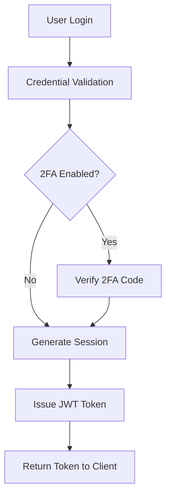

# Readability Improvement Gui

d

e **Version:** 1.1 **Last Updated:** May 18, 2025 **Status:** Active **Author:** Documentation Team **Audience:** Content Writers, Technical Authors, Developers **AI-Index:** This guide provides techniques and best practices for improving document readability with concrete before/after examples. It focuses on plain language, sentence structure, active voice, paragraph organization, and visual formatting to address the low readability scores (14.7/100) identified in our documentation quality analysis.

## Overview This guide provides techniques and best practices for improving document readability. Our documentation quality analysis shows readability is our biggest challenge, with an average score of only 14.7/100 across all documents. Good documentation readability is essential fo r: - Reducing the learning curve for new developer

s

- Minimizing support requests and questions
- Improving user adoption and satisfaction
- Making documentation accessible to non-technical stakeholders
- Supporting quick troubleshooting during critical situations This guide offers practical techniques with before/after examples to transform complex, difficult-to-read content into clear, accessible documentation.

## Readability Principles ### Use Plain Language **Befor

e:**

```

The implementation of authentication mechanisms necessitates meticulous attention to security protocols and cryptographic verification procedures to ensure unauthorized access prevention.
``` **After:**
```

When building authentication, focus on security and proper verification to prevent unauthorized access.
``` ### Keep Sentences Short **Befor

e:**
```

When developing applications that require multiple authentication factors, which is increasingly common in environments where security standards mandate enhanced protection beyond simple username and password combinations, it's crucial to integrate a variety of authentication methods including biometrics, one-time passwords, and hardware tokens.
``` **After:**
```

Many applications now need multi-factor authentication. This goes beyond simple username/password login. Add options like:
- Biometrics
- One-time passwords
- Hardware tokens

``` ### Use Active Voice **Befor

e:**
```

The database is queried by the authentication service when user credentials are submitted through the login form.
``` **After:**
```

The authentication service queries the database when users submit their credentials.
``` ### Break Up Dense Paragraphs **Befor

e:**
```

TypeScript compilation errors can originate from multiple sources including type mismatches, incorrect interface implementations, missing type definitions, incompatible type assertions, and circular dependencies, all of which require different resolution approaches depending on the specific error code and context, making a systematic troubleshooting methodology essential for efficient development workflows in large-scale applications where type safety is a critical concern for maintaining code quality and preventing runtime errors that could affect production environments.
``` **After:**
```

TypeScript compilation errors come from many sources:

- Type mismatches
- Incorrect interface implementations
- Missing type definitions
- Incompatible type assertions
- Circular dependencies

Each error type needs a different solution depending on the error code and context. A systematic troubleshooting approach helps maintain efficient development workflows in large applications where type safety is crucial.
``` ### Use Headings and Lists **Befor

e:**
```

The security scanning process includes static code analysis for vulnerability detection, dependency scanning for known CVEs, container image scanning to identify OS-level vulnerabilities, and dynamic application security testing to find runtime vulnerabilities, along with secret scanning to prevent credential leakage.
``` **After:**
```

## Security Scanning Proce

s

s

Our security scanning includes:

1. **Static code analysis** - Detects code vulnerabilities

2. **Dependency scanning** - Identifies known CVEs

3. **Container image scanning** - Finds OS-level vulnerabilities

4. **Dynamic application testing** - Discovers runtime issues

5. **Secret scanning** - Prevents credential leakage

``` ### Use Concrete Examples **Befor

e:**
```

Implement proper authentication to secure the API.
``` **After:**
```

Implement proper authentication to secure the API. For example:

```javascript
// Using JWT authentication middleware app.use('/api/secure', verifyJWT, secureRoutes); function verifyJWT(req, res, next) { const token = req.headers['authorization']?.split(' ')[1]; if (!token) { return res.status(401).json({ message: 'No token provided' }); } jwt.verify(token, process.env.JWT_SECRET, (err, decoded) => { if (err) { return res.status(403).json({ message: 'Failed to authenticate token' }); } req.user = decoded; next(); });
}
```

### Define Technical Ter

m

s

**Before:**
``` Implement proper CORS configuration to mitigate XSS vulnerabilities.
```

**After:**
``` Implement proper CORS (Cross-Origin Resource Sharing) configuration to mitigate XSS (Cross-Site Scripting) vulnerabilities. CORS is a security feature that restricts which websites can access your API. XSS attacks inject malicious scripts into web pages viewed by users.
```

### Use Visual Ai

d

s

**Before:**
``` The authentication flow proceeds through multiple stages including initial credential validation, two-factor verification if enabled, session generation, and JWT issuance for subsequent authorized requests.
```

**After:**
``` The authentication flow proceeds through multiple stages:



## Readability Checklist Before finalizing any document, verify: - [ ] Average sentence length is under 20 word s - [ ] Paragraphs are limited to 3-5 sentence

s

- [ ] Technical terms are defined when first used
- [ ] Active voice is used consistently
- [ ] Content is organized with clear headings
- [ ] Lists are used for enumerating items
- [ ] Code examples illustrate complex concepts
- [ ] No unnecessary jargon
- [ ] Readability tools score the content at appropriate level

## Tools for Measuring Readability - [Hemingway Editor](https://hemingwayapp.com/) - Highlights complex sentences and suggests simplification s - [Grammarly](https://www.grammarly.com/) - Checks for clarity and concisenes

s

- [Readable](https://readable.com/) - Provides scores on multiple readability scales

## Implementation Process 1. Start with the lowest-scoring documents firs t 2. Apply these readability techniques 3. Use readability tools to measure improvement 4. Review with both technical and non-technical readers 5. Iterate based on feedbac

k

## Related Documentation - [Documentation Standards](../DOCUMENTATION_STANDARDS.

m

d) - [Content Style Guide](../content-style-guide.md)
- [Technical Writing Best Practices](../technical-writing-best-practices.md)

## See Also - [Documentation Planning Guide](../DOCUMENTATION_PLANNING_GUIDE.md) - 17% matc h - [Documentation Updates Guide](../DOCUMENTATION_UPDATES.md) - 17% matc

h

- [Token Efficiency Standards for Documentation](../TOKEN_EFFICIENCY_STANDARDS.md) - 17% match
- [File Upload Security Quick Start Guide](../file-upload-quickstart.md) - 17% match
- [Documentation Maintenance Guide](../maintenance/DOCUMENTATION_MAINTENANCE.md) - 17% match